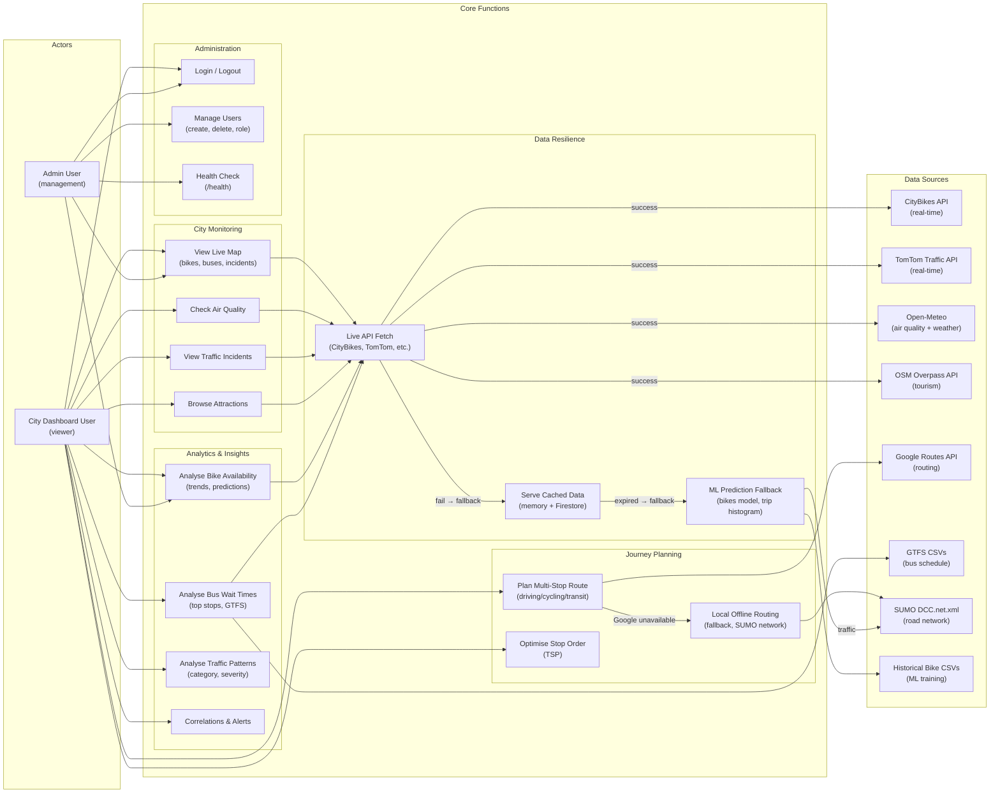
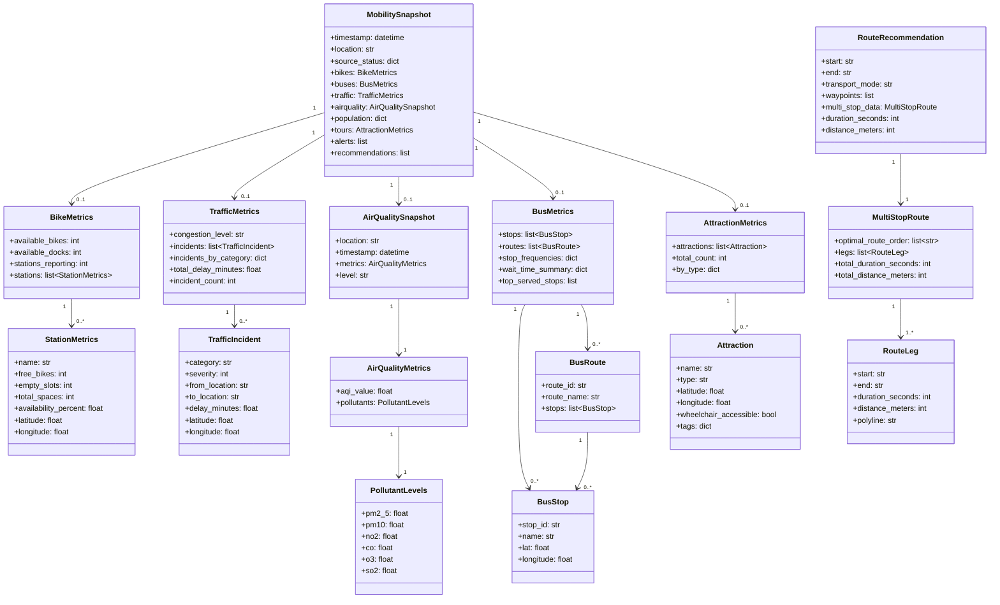
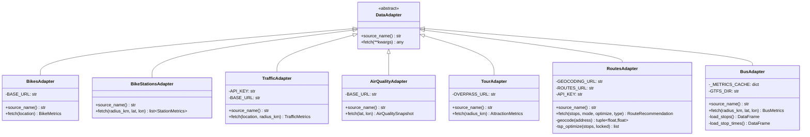
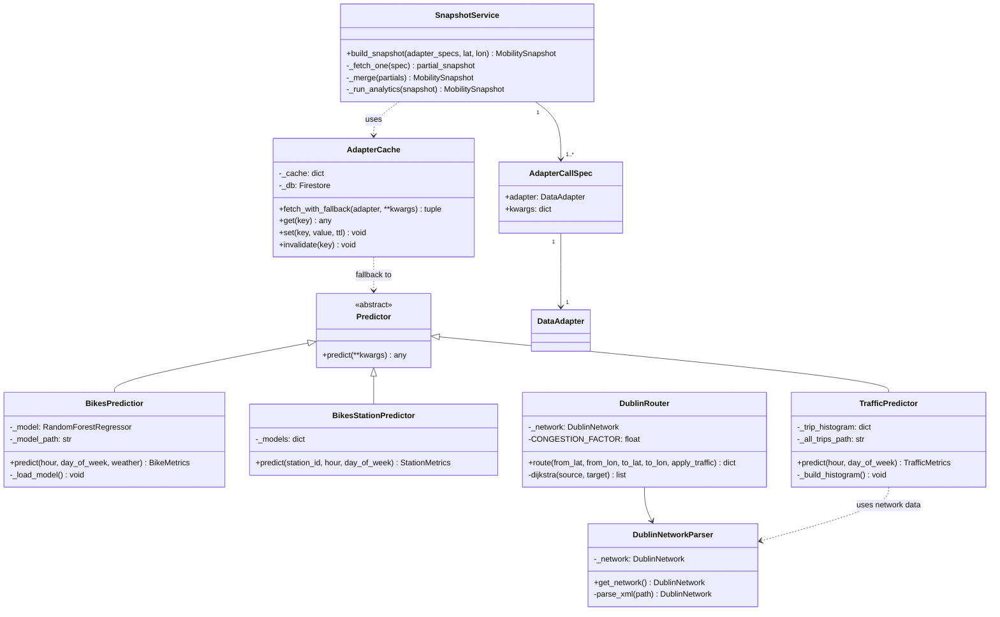
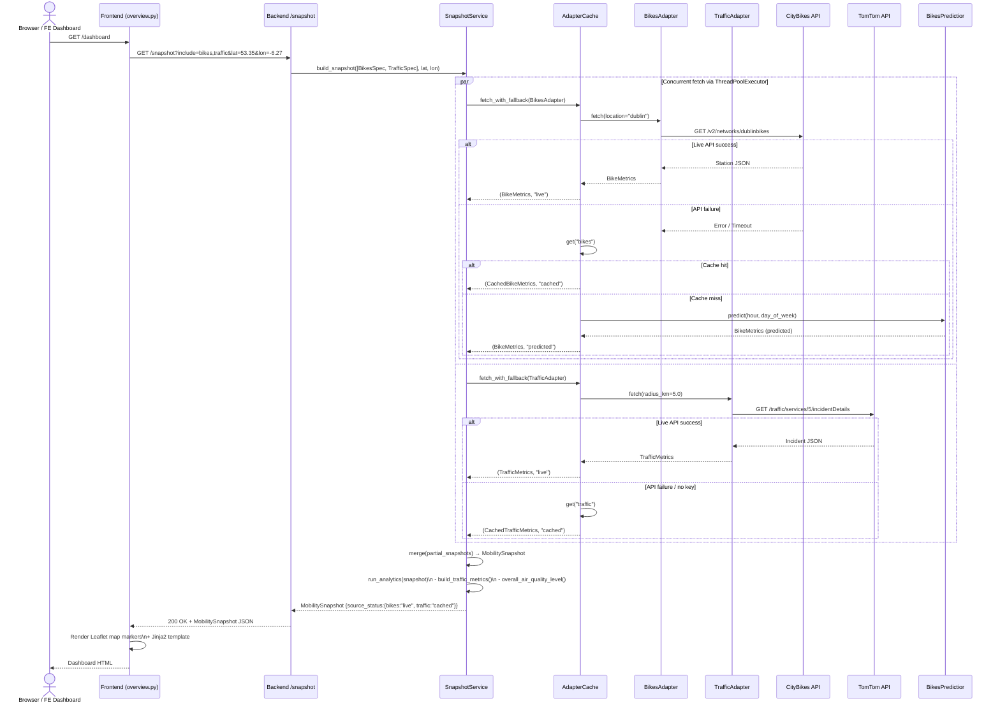
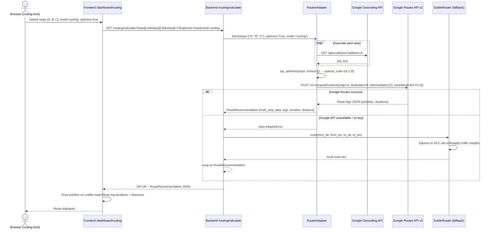
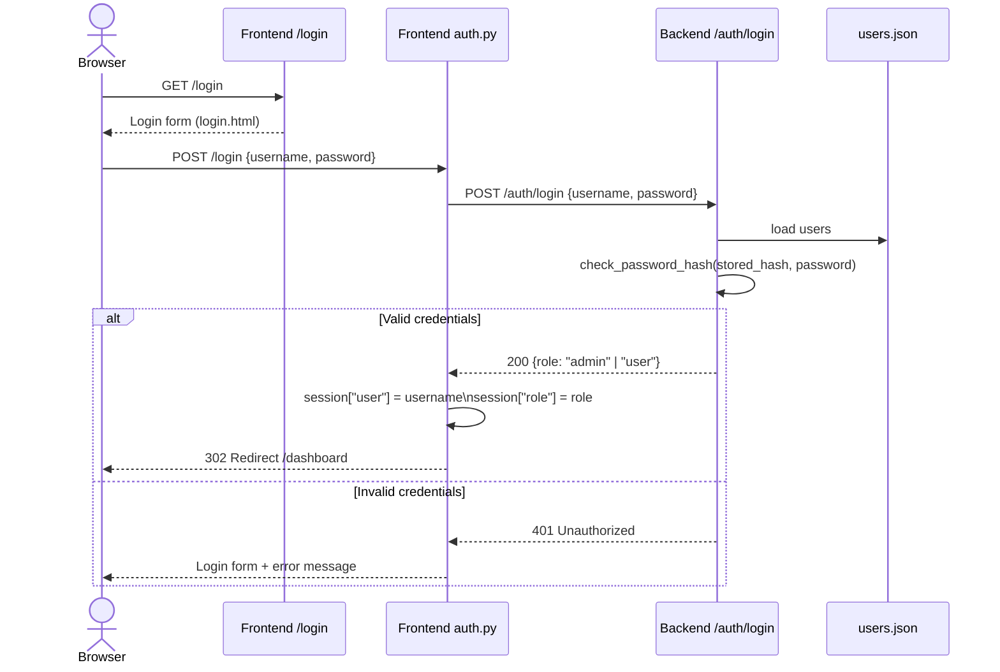
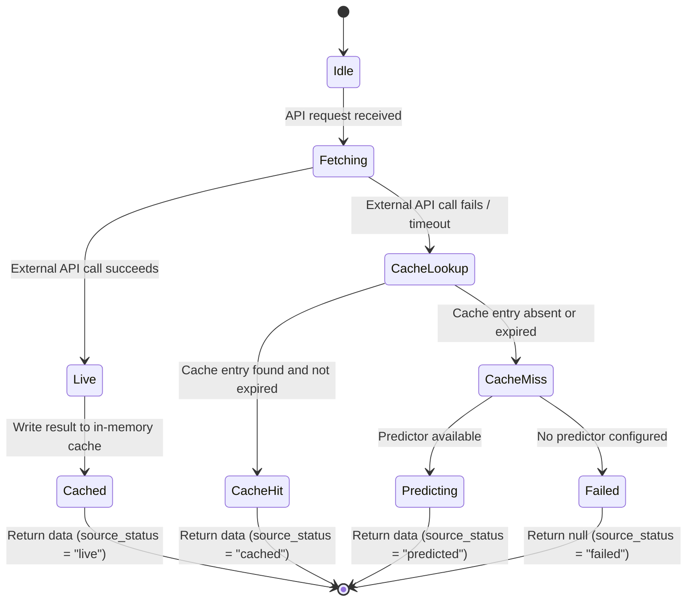
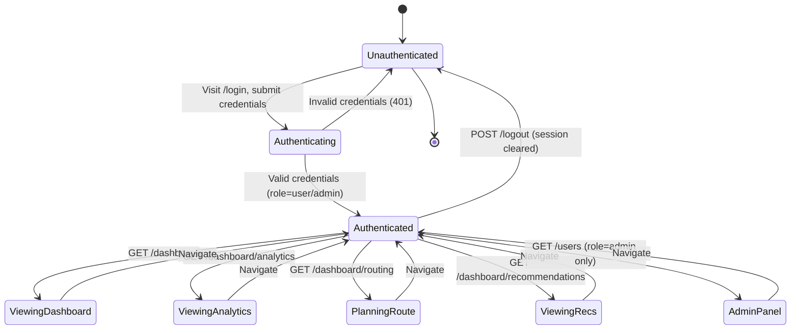

```mermaid
graph TB
    subgraph Client["Client Layer"]
        Browser["Web Browser"]
    end

    subgraph FE["Frontend Service (Flask + Jinja2)"]
        FEApp["Flask App\n(frontend/app.py)"]
        Auth["Auth Blueprint\n(/login, /users)"]
        Overview["Overview Blueprint\n(/dashboard)"]
        Analytics["Analytics Blueprint\n(/dashboard/analytics)"]
        Routing_UI["Routing Blueprint\n(/dashboard/routing)"]
        Recs["Recommendations Blueprint\n(/dashboard/recommendations)"]
        Templates["Jinja2 Templates\n+ Leaflet.js + Chart.js"]
    end

    subgraph BE["Backend API Service (Flask)"]
        BEApp["Flask App\n(backend/app.py)"]

        subgraph Endpoints["API Endpoints (Blueprints)"]
            EP_bikes["/bikes"]
            EP_traffic["/traffic"]
            EP_air["/airquality"]
            EP_buses["/buses/stops"]
            EP_tours["/tours"]
            EP_snap["/snapshot"]
            EP_route["/routing/calculate"]
            EP_auth["/auth/*"]
            EP_health["/health"]
            EP_eff["/efficiency"]
        end

        subgraph SVC["Services Layer"]
            SnapSvc["SnapshotService\n(ThreadPoolExecutor)"]
        end

        subgraph Adapters["Adapters Layer"]
            BikesAdp["BikesAdapter"]
            TrafficAdp["TrafficAdapter"]
            AirAdp["AirQualityAdapter"]
            BusAdp["BusAdapter (GTFS)"]
            TourAdp["TourAdapter"]
            RoutesAdp["RoutesAdapter"]
        end

        subgraph Analytics["Analytics Layer"]
            TrafficAn["traffic_analytics"]
            AirAn["airquality_analytics"]
            BikeAn["bike_analytics"]
            BusAn["bus_analytics"]
        end

        subgraph Fallback["Fallback / Cache Layer"]
            Cache["AdapterCache\n(in-memory + Firestore)"]
            BikePred["BikesPredictior\n(sklearn RF)"]
            TrafficPred["TrafficPredictor\n(SUMO histogram)"]
        end

        subgraph LocalNet["Dublin Network Module"]
            NetParser["network_parser\n(DCC.net.xml)"]
            Router["DublinRouter\n(Dijkstra)"]
            TripPred["TrafficPredictor\n(all_trips.csv)"]
        end

        subgraph Models["Domain Models"]
            MobSnap["MobilitySnapshot"]
            BikeM["BikeMetrics"]
            TrafficM["TrafficMetrics"]
            AirM["AirQualitySnapshot"]
            BusM["BusMetrics"]
            TourM["AttractionMetrics"]
            RouteM["RouteRecommendation"]
        end
    end

    subgraph External["External APIs"]
        CityBikes["CityBikes API\n(api.citybik.es)"]
        TomTom["TomTom Traffic API"]
        OpenMeteo["Open-Meteo\n(Air Quality + Weather)"]
        Overpass["OSM Overpass API\n(Tourism)"]
        GoogleRoutes["Google Routes API v2"]
        GoogleGeo["Google Geocoding API"]
    end

    subgraph Persist["Persistence"]
        Firestore["Cloud Firestore\n(cache persistence)"]
        GTFS["GTFS CSVs\n(bus data)"]
        UsersJSON["users.json\n(auth)"]
        MLArtifact["bikes_model.joblib\n(ML artifact)"]
        SUMONet["DCC.net.xml\n(SUMO network)"]
        Trips["all_trips.csv\n(500k trips)"]
    end

    subgraph Infra["Infrastructure (GCP)"]
        CloudBuild["Cloud Build\n(CI/CD)"]
        GKE["GKE Cluster\n(Kubernetes)"]
        GitHub["GitHub Actions\n(PR tests)"]
    end

    Browser --> FEApp
    FEApp --> Auth
    FEApp --> Overview
    FEApp --> Analytics
    FEApp --> Routing_UI
    FEApp --> Recs
    FEApp --> Templates

    FEApp -->|HTTP REST| BEApp
    Overview -->|"/snapshot, /bikes/stations, /buses/stops"| BEApp
    Analytics -->|"/airquality, /traffic, /bikes, /buses"| BEApp
    Routing_UI -->|"/routing/calculate"| BEApp
    Recs -->|"/snapshot"| BEApp

    BEApp --> Endpoints
    EP_snap --> SnapSvc
    EP_bikes --> BikesAdp
    EP_traffic --> TrafficAdp
    EP_air --> AirAdp
    EP_buses --> BusAdp
    EP_tours --> TourAdp
    EP_route --> RoutesAdp

    SnapSvc --> BikesAdp
    SnapSvc --> TrafficAdp
    SnapSvc --> AirAdp
    SnapSvc --> BusAdp
    SnapSvc --> TourAdp

    BikesAdp -->|"resolve_with_cache"| Cache
    TrafficAdp -->|"resolve_with_cache"| Cache
    AirAdp -->|"resolve_with_cache"| Cache

    Cache -->|"on miss"| BikePred
    Cache -->|"on miss"| TrafficPred

    BikesAdp --> CityBikes
    TrafficAdp --> TomTom
    AirAdp --> OpenMeteo
    TourAdp --> Overpass
    RoutesAdp --> GoogleRoutes
    RoutesAdp --> GoogleGeo

    BusAdp --> GTFS
    EP_auth --> UsersJSON
    BikePred --> MLArtifact
    Cache <-->|"optional"| Firestore

    Router --> NetParser
    NetParser --> SUMONet
    TripPred --> Trips

    SnapSvc --> Analytics
    Analytics --> Models
    Adapters --> Models

    CloudBuild --> GKE
    GitHub --> CloudBuild
```

# Group 9 — Sustainable City Management: Semester 2 Deliverables

**Module:** CS7CS3 Advanced Software Engineering  
**Team:** Group 9  
**Contributors:** Oisin Power, Darragh Hassett, Ciarán O'Malley, Parker Kavanagh, Aoife Walshe

---

## Table of Contents
1. [Technical Architecture Description](#1-technical-architecture-description)
2. [Functional Architecture Description](#2-functional-architecture-description)
3. [Detailed System Structure Models](#3-detailed-system-structure-models)
4. [Detailed System Behavioural Models](#4-detailed-system-behavioural-models)
5. [Project Diary](#5-project-diary)
6. [Compile and Deployment Instructions](#6-compile-and-deployment-instructions)

---

## 1. Technical Architecture Description

### Diagram



### Changes from Thin Slice

The thin slice architecture (Semester 1) established the adapter pattern, core models, and GKE deployment. Semester 2 additions include:

- **Frontend Service**: A complete Flask/Jinja2 dashboard was added with Leaflet.js maps, Chart.js analytics, and a multi-stop route planner — this is an entirely new service not present in the thin slice.
- **Dublin Network Module** (`backend/dublin_network/`): Renamed and extended from a prototype traffic model. Now includes full SUMO network parsing (`DCC.net.xml`, 115K lines), Dijkstra-based local routing, and a 500k-trip historical predictor as a fully offline fallback.
- **ML Layer** (`backend/ml/`): A scikit-learn RandomForest model for bike availability prediction was added, trained on historical Dublin Bikes station data with optional weather integration.
- **Bus Analytics**: A comprehensive GTFS-based bus module was added (`BusAdapter`, `bus_analytics`), parsing stop times to compute wait times, top-served stops, and importance scores — absent from the thin slice.
- **Fallback/Cache Layer**: The `AdapterCache` was extended with Firestore-backed persistence (optional) to survive Cloud Run/GKE pod restarts.
- **Auth Module**: User login, role-based access (admin/user), and user management endpoints were added.
- **Efficiency Endpoint**: A new `/efficiency` endpoint for transport emissions calculations.

---

## 2. Functional Architecture Description

### Diagram



### Changes from Thin Slice

The functional architecture is largely consistent with the thin slice design. The key additions are:

- **Journey Planning** functions (F9–F11) were implemented in full, including TSP-based stop optimisation and the offline SUMO routing fallback.
- **Bus Analytics** (F6) was promoted from a placeholder to a fully working function backed by GTFS data.
- **ML Prediction Fallback** (F14) was implemented and integrated into the resilience chain.
- **Administration** (F15–F17) was added: login, user management, and health checks.
- The **Data Resilience** chain (F12 → F13 → F14) now completes the three-tier fallback that was only partially designed in the thin slice.

---

## 3. Detailed System Structure Models

### 3.1 Core Domain Model (UML Class Diagram)



### 3.2 Adapter Layer (UML Class Diagram)



### 3.3 Services, Fallback and ML (UML Class Diagram)



---

## 4. Detailed System Behavioural Models

### 4.1 Sequence Diagram: GET /snapshot (Multi-Domain Request)



### 4.2 Sequence Diagram: POST /routing/calculate (Multi-Stop Route)



### 4.3 Sequence Diagram: User Login



### 4.4 State Diagram: Adapter Data Freshness



### 4.5 State Diagram: User Session



---

## 5. Project Diary

### 5.1 Project Approach

The project followed a **Kanban-style agile workflow** tracked on a JIRA board (`KAN-*` ticket numbering). Development was organised into feature branches (one branch per JIRA ticket), with squash-merge pull requests into `main`. All PRs required at least one code review before merging.

Code quality was enforced automatically via pre-commit hooks (Black autoformatter + pycodestyle PEP8 checks), GitHub Actions CI on every PR, and a smoke test suite (`smoke_test.ps1`).

The architecture was designed around the **Adapter Pattern**: each external data source is encapsulated behind a `DataAdapter` interface, allowing independent development, mocking, and testing of each integration. A unified `MobilitySnapshot` model allowed all domain teams to work in parallel without blocking each other.

### 5.2 Labour Division

| Team Member | Primary Responsibilities |
|---|---|
| **Darragh Hassett** | GTFS bus adapter, bus analytics, cloud deployment (GKE, Cloud Build, Kubernetes), snapshot service wiring, auth |
| **Oisin Power** | Dublin Network module (SUMO routing, traffic prediction), ML bike model, frontend overview/analytics, bug fixes |
| **Ciarán O'Malley** | Traffic adapter, air quality adapter, analytics layer, API contract validation |
| **Parker Kavanagh** | Routes adapter (Google Maps, TSP optimisation), routing frontend, efficiency endpoint |
| **Aoife Walshe** | Tour adapter, bike adapter & analytics, recommendations, fallback caching, ML integration |

### 5.3 Time Estimates vs Actual Time

| Ticket | Feature | Estimated | Actual | Notes |
|---|---|---|---|---|
| KAN-41/43/46 | Core adapters (bikes, traffic, airquality, tour) | 3 days | 4 days | External API shape differences required model rework |
| KAN-52/53/54 | SnapshotService + GKE cluster deployment | 2 days | 4 days | Cloud Build + Kubernetes config took significant iteration |
| KAN-55/58 | Flask blueprint wiring, health endpoint | 1 day | 1 day | On target |
| KAN-59/61 | FastAPI → Flask migration, caching layer | 1.5 days | 2 days | Framework change required re-testing all endpoints |
| KAN-62 | Module path standardisation (import fixes) | 0.5 days | 1 day | Cloud Run import resolution was non-trivial |
| KAN-66/67 | Frontend Flask app + Jinja2 dashboard | 3 days | 5 days | Leaflet map integration and Jinja2 data wiring more complex than expected |
| KAN-71 | SUMO offline routing (Dublin Network module) | 3 days | 4 days | DCC.net.xml coordinate conversion and Dijkstra tuning |
| KAN-73 | Bikes ML model (RandomForest + weather) | 2 days | 2.5 days | Feature engineering for weather slightly underestimated |
| KAN-75 | Bus analytics (GTFS wait times, importance) | 2 days | 3 days | GTFS file filtering and cache invalidation took extra time |
| KAN-76 | Recommendations + optimisations | 1.5 days | 1.5 days | On target |
| KAN-78 | Efficiency routing mechanism | 1.5 days | 2 days | Integration with Google Routes required extra auth handling |
| KAN-82/83/84 | Bug fixes, test coverage 84% → 91%, executable | 2 days | 2.5 days | Edge cases in SUMO coordinate conversion |
| User Login (KAN) | Auth module (login, user management) | 1 day | 1.5 days | Session management + admin role checking |

**Total estimated:** ~25 days (team-aggregate)  
**Total actual:** ~34 days (team-aggregate)

### 5.4 Impact of and Response to Inaccurate Estimates

**Cloud deployment complexity (KAN-52/53):** GKE deployment took twice as long as estimated. The team had underestimated the iteration cycles needed for Kubernetes manifest tuning, image naming, and Cloud Build pipeline configuration. In response, a dedicated `cloudbuild.yaml` and separate `k8s/` directory were established with clear ownership (Darragh), preventing others from being blocked.

**Frontend (KAN-66/67):** The Jinja2 dashboard took 5 days vs 3 estimated. Leaflet.js marker rendering with live API data, template component decomposition, and session-aware navigation were each more involved than anticipated. The response was to scope the frontend to server-side rendering only (no React/SPA), which reduced complexity and allowed faster iteration, at the cost of some interactivity.

**SUMO routing (KAN-71):** The SUMO coordinate conversion from local SUMO space to WGS-84 required careful derivation of the linear interpolation formula from the `DCC.net.xml` `convBoundary` and `origBoundary` attributes. This was not anticipated at planning time and added roughly a day of work.

**Module import paths (KAN-62):** Cloud Run's Python path resolution differed from local development. The fix (standardising all imports to relative package paths and ensuring correct working directory) was straightforward but took a full day of diagnosis. This led to the addition of a `localStart.ps1` script to enforce consistent startup conditions.

**Estimation pattern:** Across the project, infrastructure/integration tasks were consistently underestimated by ~50%, while pure Python feature work was estimated accurately. Future iterations would allocate a 1.5× buffer for any task involving external API integration, cloud deployment, or cross-service wiring.

---

## 6. Compile and Deployment Instructions

### 6.1 Prerequisites

- Python 3.12+
- Git
- (Optional) Docker
- (Optional) Google Cloud SDK (`gcloud`) for GKE deployment
- API keys: `TOMTOM_API_KEY`, `GOOGLE_MAPS_API_KEY` (set as environment variables)

### 6.2 Local Development Setup

#### Clone the repository

```bash
git clone https://github.com/CS7CS3-Group-9/CS7CS3-ASE-Group9.git
cd CS7CS3-ASE-Group9
```

#### Install backend dependencies

```bash
pip install -r backend/requirements.txt
```

#### Install frontend dependencies

```bash
pip install -r frontend/requirements.txt
```

#### One-time pre-commit setup (for contributors)

```bash
pip install pre-commit pycodestyle
python -m pre_commit install
```

### 6.3 Running the Backend API

From the repository root:

```bash
# Minimal local run (no Firestore, no paid APIs)
export ENABLE_FIRESTORE=false
python -m flask --app backend.app:create_app --debug run --port 5000
```

With optional API keys:

```bash
export TOMTOM_API_KEY=your_key_here
export GOOGLE_MAPS_API_KEY=your_key_here
export ENABLE_FIRESTORE=false
python -m flask --app backend.app:create_app --debug run --port 5000
```

With ML bike prediction:

```bash
export BIKES_MODEL_PATH=backend/ml/artifacts/bikes_model.joblib
export WEATHER_FORECAST_PATH=data/historical/weather_forecast.csv
python -m flask --app backend.app:create_app --debug run --port 5000
```

Windows (PowerShell via `localStart.ps1`):

```powershell
.\localStart.ps1
```

Backend is available at: `http://127.0.0.1:5000`

### 6.4 Running the Frontend Dashboard

```bash
export BACKEND_API_URL=http://localhost:5000
export FLASK_DEBUG=true
python -m flask --app frontend.app:create_app --debug run --port 8080
```

Dashboard is available at: `http://127.0.0.1:8080`

### 6.5 Running Tests

#### Backend unit and integration tests

```bash
pytest backend/ -v
```

#### Dublin Network module tests (82 tests)

```bash
pytest backend/dublin_network/tests/ -v
```

#### All tests with coverage report

```bash
pytest backend/ --cov=backend --cov-report=term-missing
```

#### Smoke tests (requires running API)

```powershell
.\smoke_test.ps1
# or
powershell -ExecutionPolicy Bypass -File .\smoke_test.ps1
```

### 6.6 Training the Bikes ML Model

```bash
python backend/ml/train_bikes_model.py \
  --input data/historical/dublin-bikes_station_status_042025.csv \
  --weather data/historical/weather_forecast.csv
```

The trained artifact is saved to `backend/ml/artifacts/bikes_model.joblib`.

### 6.7 Docker Build

#### Backend

```bash
docker build -t sustainable-city-backend ./backend
docker run -p 5000:5000 \
  -e ENABLE_FIRESTORE=false \
  -e TOMTOM_API_KEY=your_key \
  -e GOOGLE_MAPS_API_KEY=your_key \
  sustainable-city-backend
```

#### Frontend

```bash
docker build -t sustainable-city-frontend ./frontend
docker run -p 8080:8080 \
  -e BACKEND_API_URL=http://host.docker.internal:5000 \
  sustainable-city-frontend
```

### 6.8 GKE / Cloud Deployment

Deployment is automated via Cloud Build on push to `main`:

```bash
gcloud builds submit --config cloudbuild.yaml
```

Kubernetes manifests are in `k8s/`. To apply manually:

```bash
kubectl apply -f k8s/backend-deployment.yaml
```

### 6.9 Key Environment Variables Reference

| Variable | Required | Default | Description |
|---|---|---|---|
| `TOMTOM_API_KEY` | No | — | TomTom Traffic Incidents API key |
| `GOOGLE_MAPS_API_KEY` | No | — | Google Geocoding + Routes API key |
| `ENABLE_FIRESTORE` | No | `false` | Enable Firestore cache persistence |
| `BIKES_MODEL_PATH` | No | — | Path to trained bikes joblib artifact |
| `FORCE_BIKES_PREDICTION` | No | `0` | `1` to skip live API, use ML only |
| `WEATHER_FORECAST_PATH` | No | — | CSV with weather features for ML |
| `WEATHER_AUTO_REFRESH` | No | `true` | Auto-refresh weather forecast cache |
| `WEATHER_REFRESH_HOURS` | No | `24` | Hours between weather cache refreshes |
| `BACKEND_API_URL` | Yes (FE) | — | Frontend → Backend base URL |
| `SECRET_KEY` | No | random | Flask session secret key |
| `FLASK_DEBUG` | No | `false` | Enable Flask debug mode |
| `REFRESH_INTERVAL` | No | `60` | Dashboard auto-refresh interval (seconds) |

### 6.10 API Endpoints Summary

| Method | Endpoint | Description |
|---|---|---|
| GET | `/health` | Service health + adapter status |
| GET | `/snapshot` | Multi-domain unified snapshot |
| GET | `/bikes` | Real-time bike availability |
| GET | `/bikes/stations` | Per-station bike data |
| GET | `/traffic` | Live traffic incidents |
| GET | `/airquality` | Air quality + pollutant levels |
| GET | `/buses/stops` | Bus stops + GTFS wait times |
| GET | `/tours` | Tourism attractions |
| GET | `/routing/calculate` | Multi-stop route planning |
| GET | `/efficiency` | Transport emissions calculations |
| POST | `/auth/login` | Authenticate user |
| GET | `/auth/users` | List users (admin) |
| POST | `/auth/users` | Create user (admin) |
| POST | `/auth/users/delete` | Delete user (admin) |
